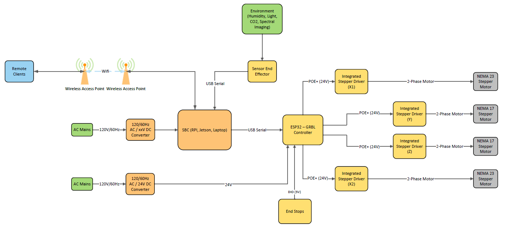
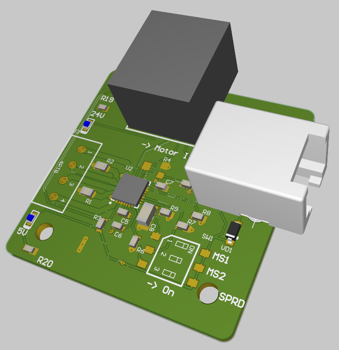

## Overview 
The electrical subsystem was designed with 3 key elements in mind: 

* Plug and Play operation 
* System Reliability 
* Expandable operation 

Plug-and-Play operation was taken to mean minimal requirements for hookups and other connections and to prioritize standard connectors that are easily available from commercial outlets. System Reliability was necessary for operation under a wide variety of conditions (wide Vin range, built-in protections, and temperature/humidity resistance) and to limit repairs by the user. Finally, it was assumed that this system should be able to accommodate other configurations than just a 3D CNC gantry and should have features that can be expanded for later development. 

## System Diagram 

A system diagram was created to help design the infrastructure and architecture for the overall system. In this case my idea was to approach every operable component as a "node" which could act as an independent unit. The reasoning being that I could assign each "node" to team members and give them a black box explanation for each. As an example, the motor node circuit needed to operate using the following parameters: 

+----------------------+-----------------------------------+
| Parameter            | Valid ranges                      |
+======================+===================================+
| Vin Range            | 12 - 30V                          |
+----------------------+-----------------------------------+
| Motor Current (rms)  |  2A                               |
+----------------------+-----------------------------------+
| Signal Inputs        | Step, En, Dir (STEP/DIR control)  |
+----------------------+-----------------------------------+
| Step Frequency       | < = 5Khz                          |
+----------------------+-----------------------------------+
| Microstepping        | 1x - 16x                          |
+----------------------+-----------------------------------+
| Input Interface      | RJ45 8 pin                        |
+----------------------+-----------------------------------+

By providing the specification and known inputs / outputs I could keep each node organized and have the ability to assign its development to any members that were working under my at the time. 

The main blocks in the system diagram that needed to be developed were: 
* Integrated Stepper Driver (Motor Node) 
* ESP32 GRBL Controller 
    * This node was meant to be the main firmware controller which would determine the signals to be sent to each motor to tell it where to move. This could be abstracted to basically just run any CNC control firmware such as Marlin, GRBL, or LinuxCNC. While researching it was determined that the ESP32 GRBL firmware met all the requirements and more with little to no development necessary (see the ESP32 GRBL section)

## Motor Nodes

## ESP-32 Controller

The ESP-32 Controller was designed to be the liaison between motion requests by the ROS software and the rest of the machine. The board itself is computationally powered with an ESP32-WROOM module (either through a daughter dev-board or embedded on the board) running the [GRBL_esp32](https://github.com/bdring/Grbl_Esp32) firmware. A key aspect of using the GRBL style firmware over other flavors (such as Marlin or otherwise) is that GRBL supports the ESP32 with no perquisites and can support a Web-UI natively for manual control. 

## Magnetic End Stops

## Main System

